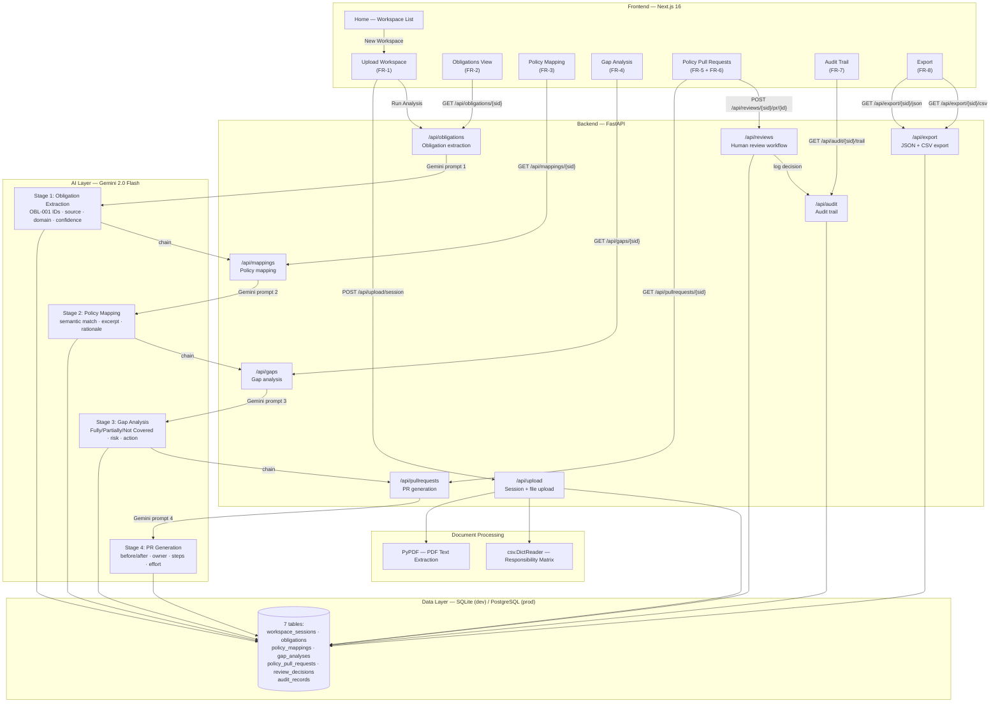

# RegLoop AI — Closed-Loop Regulatory Execution MVP

> Transform regulatory change into a structured, human-reviewed compliance package in minutes.

**Stack**: Next.js 16 · FastAPI · SQLite/PostgreSQL · **Gemini 2.0 Flash (free)**

---

## Demo Video

▶ **[Watch the 3–5 minute walkthrough →](YOUR_LOOM_URL_HERE)**

> 📹 Replace `YOUR_LOOM_URL_HERE` with your Loom link before final submission.


**Live demo:** Run in GitHub Codespaces in under 60 seconds:
```bash
bash .devcontainer/start.sh
```
See [CODESPACES.md](./CODESPACES.md) for full instructions.

---

## What It Does

```
Regulation PDF → Extract Obligations → Map to Policies → Gap Analysis
→ Policy Pull Requests → Human Review → Audit Trail → Export
```

Every step is AI-assisted. Every decision requires human approval. No policy is ever changed automatically.

---

## Quick Start

### 1. Get a free Gemini API key
https://aistudio.google.com/app/apikey — no credit card required.

### 2. Backend

**Option A — pip (standard):**
```bash
cd backend
echo "GEMINI_API_KEY=your_key_here" > .env
pip install -r requirements.txt
uvicorn main:app --reload --port 8000
```

**Option B — uv (faster, drop-in pip replacement):**
```bash
cd backend
echo "GEMINI_API_KEY=your_key_here" > .env
uv pip install -r requirements.txt
uvicorn main:app --reload --port 8000
```

Swagger docs: http://localhost:8000/api/docs

### 3. Frontend
```bash
cd frontend
echo "NEXT_PUBLIC_API_URL=http://localhost:8000" > .env.local
npm install && npm run dev
```
App: http://localhost:3000

---

## Hosting (Cloud Deployment)

A `render.yaml` is included for one-click deployment on [Render](https://render.com) (free tier).

### Deploy to Render in 3 steps

1. Push this repo to GitHub
2. Go to [https://dashboard.render.com/](https://dashboard.render.com/) → **New** → **Blueprint**
3. Connect your repo — Render reads `render.yaml` and creates both services automatically

**Required env var:** In the Render dashboard, set `GEMINI_API_KEY` on the `regloop-backend` service.

Once deployed:
- Backend: `https://regloop-backend.onrender.com`
- Frontend: `https://regloop-frontend.onrender.com`

> **Note:** Render free tier spins down after 15 min of inactivity — the first request after a spin-down takes ~30s. For a demo, open the backend health check URL first: `https://regloop-backend.onrender.com/api/health`

---

## Codespaces (recommended — no local install needed)

See **CODESPACES.md** for the full guide. Summary:

1. Push to GitHub
2. Add `GEMINI_API_KEY` secret at github.com/settings/codespaces
3. Create codespace → runs setup automatically
4. Set port 8000 to **Public** in the PORTS tab
5. `bash .devcontainer/start.sh`
6. Open port 3000 in browser

---

## Sample Data (official reviewer inputs)

| File | Upload as |
|------|-----------|
| `sample_data/DORA_ICT_Risk_Update_2026.pdf` | Regulatory Update |
| `sample_data/ICT_Risk_Policy.pdf` | Internal Policy |
| `sample_data/Vendor_Risk_Policy.pdf` | Internal Policy |
| `sample_data/Incident_Response_Policy.pdf` | Internal Policy |
| `sample_data/responsibility_matrix.csv` | Responsibility Matrix |

---

## Architecture



---

## FR Compliance

| FR | Feature | Implementation |
|----|---------|---------------|
| FR-1 | Upload workspace | Single-call session creation: 1 regulation + 1-3 policies + 1 CSV; files removable/replaceable; Reset button for re-upload |
| FR-2 | Obligation extraction | OBL-001 IDs, statement, full_text, **source = verbatim exact text excerpt** from regulation, domain, confidence, notes |
| FR-3 | Policy mapping | Semantic via Gemini; **single best-match per obligation** (reviewer confirmed); excerpt + rationale + confidence bar |
| FR-4 | Gap analysis | Fully/Partially/Not Covered + High/Medium/Low + recommended_action; detects vague language vs specific requirements |
| FR-5 | Policy PR generator | before_text, after_text, implementation_steps, estimated_effort, regulatory_citation, suggested_owner |
| FR-6 | Human review | Approve / Reject / Modify / Escalate; reviewer name + notes; override/re-review supported; audit-recorded |
| FR-7 | Audit memory | Per-obligation 5-column traceability grid + full chronological event log; summary stats card |
| FR-8 | Export | JSON (nested + audit trail + traceability) + CSV (all columns inc. before/after, owner, review decisions) |

### Key Implementation Locations (for reviewers)

| What | File | Symbol |
|------|------|--------|
| All 4 review actions (Approve/Reject/Modify/Escalate) | `backend/routers/reviews.py` | `VALID_ACTIONS`, `ACTION_NORMALISE` (lines 21–30) |
| CSV export | `backend/routers/export.py` | `export_csv` (lines 137–197) |
| JSON export | `backend/routers/export.py` | `export_json` (line 126) |
| LLM provider: Gemini 2.0 Flash | `backend/services/ai_service.py` | `MODEL = "gemini-2.0-flash"`, `_get_client()` |
| API key config | `backend/.env.example` | `GEMINI_API_KEY` |
| PostgreSQL support | `backend/.env.example` | `DATABASE_URL=postgresql+asyncpg://...` (line 11) |
| File remove/replace (pre-session) | `frontend/app/workspace/[id]/page.tsx` | `onRemovePolicy`, `setRegulation(null)`, `setMatrix(null)` |
| Full workspace reset (post-session) | `frontend/app/workspace/[id]/page.tsx` | `onReset` handler (line 377) |

---

## AI Design

**4 sequential Gemini prompts per analysis run:**

| Stage | Purpose | Fallback |
|-------|---------|---------|
| Obligation Extraction | Extract every obligation with OBL-001 IDs, full_text, domain | 14 DORA-specific hardcoded obligations |
| Policy Mapping | Semantic match to policy sections with rationale | Domain-based fallback mappings |
| Gap Analysis | Coverage + risk + recommended action — detects "periodically" vs "annually" | 14 DORA-specific gap descriptions |
| PR Generation | before/after amendment + implementation steps | 14 DORA-specific policy amendments |

**Fallbacks**: if Gemini is unavailable or rate-limited, the system returns realistic DORA-specific data so the demo always works. When fallback data is active, the UI displays a yellow warning banner on the Obligations tab prompting the user to verify their API key and re-run.

---

## Known Limitations (Prototype Scope)

| Limitation | Detail |
|-----------|--------|
| Single-user, no auth | By design — challenge spec says no auth needed. `allow_origins=["*"]` is intentional for Codespaces/demo use; restrict in production. |
| Regulation text truncated at 20 000 chars | Gemini output cap. A warning banner is shown in the UI when truncation occurs. |
| Policy text truncated at 15 000 chars per doc | Same reason. Shown in upload warning banner. |
| Session locked after analysis | Re-upload requires creating a new workspace. |
| No Alembic migrations | SQLAlchemy `create_all` handles table creation. For production, generate migrations from the schema in `db/database.py`. |

---

## License
MIT
